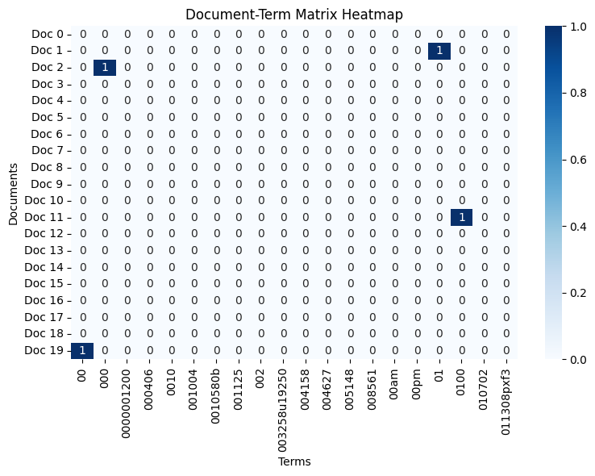
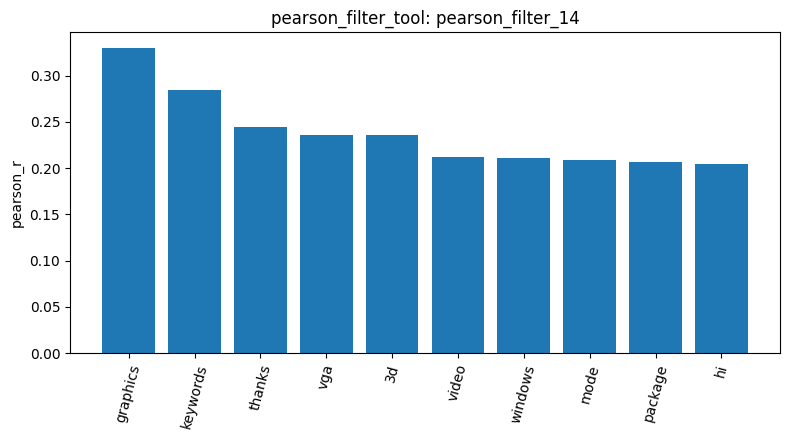
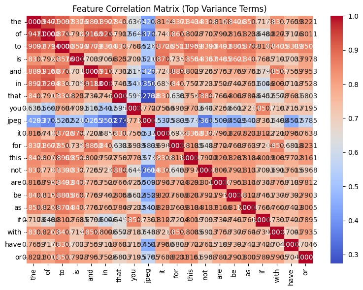
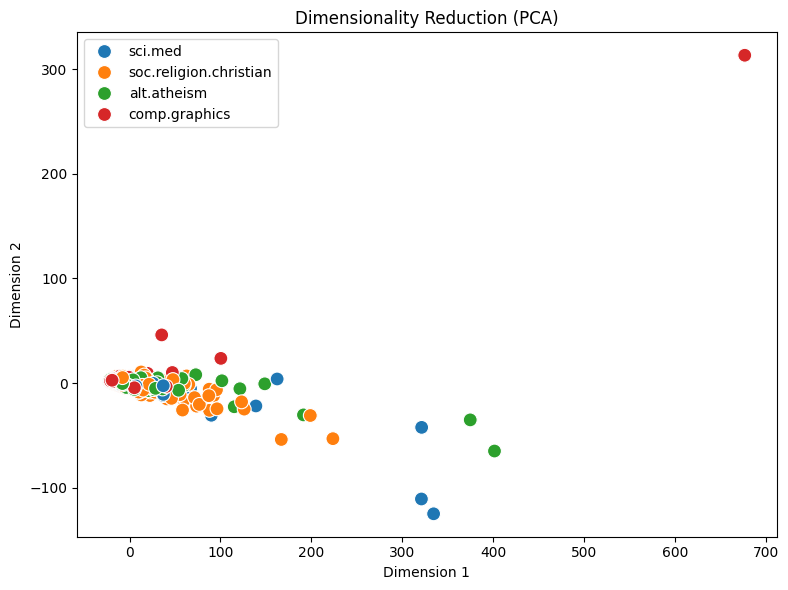
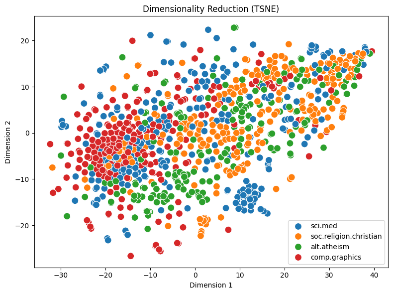
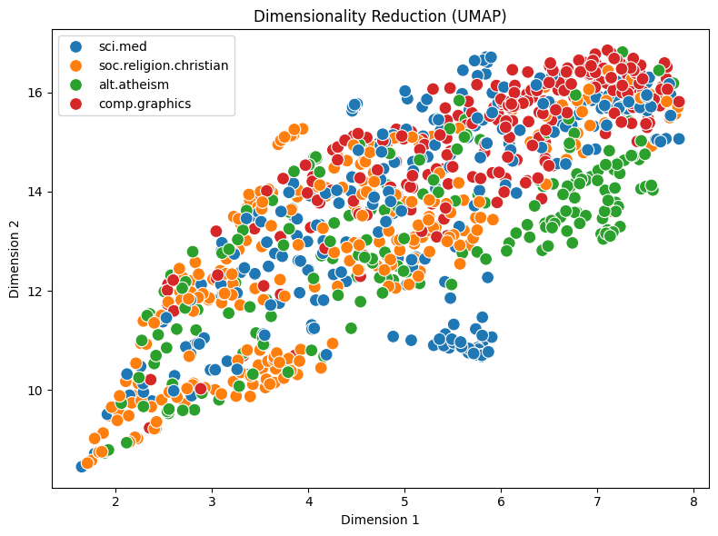

# Agentic Pipeline Report

(Each tool execution generated a unique (result_id), which I use below to reference the corresponding analysis result.)

I first loaded the four selected 20 Newsgroups categories and obtained 2,257 documents (load_dataset_1). The dataset contained no missing text (check_missing_3) and no duplicate documents (check_duplicates_4). After inspecting and describing the data (inspect_data_2, describe_data_5), I randomly sampled 1,000 documents with random_state=42 for the remaining analysis (sample_data_6). The sampled class counts remained reasonably close to the original distribution (describe_data_10), although they were not identical, which illustrates the variation introduced by simple random sampling.

Using the 1,000-document sample, I built a document-term matrix with 22,538 features and 99.29% sparsity (dtm_7). The most frequent terms were mainly common English words such as "the", "to", and "of" (term_freq_8), and the DTM heatmap (dtm_heatmap_9) also showed that most cells were zero. Variance filtering showed a strong reduction in vocabulary as the threshold increased: 22,538 features were retained at 0.0 (variance_filter_11), 4,759 at 0.01 (variance_filter_12), and 1,586 at 0.05 (variance_filter_13). These values differ from the Master notebook because this pipeline used a 1,000-document sample and a different vectorizer configuration, so the results should not be compared as if they were generated from the same input matrix.

For correlation-based feature analysis, I used comp.graphics as the target class. Pearson correlation (pearson_filter_14) ranked terms such as "graphics", "vga", "3d", "video", and "windows" highly, while Spearman correlation (spearman_filter_15) emphasized terms including "graphics", "files", "3d", "windows", "ftp", "gif", and "image". This suggests that both methods identified domain-relevant vocabulary, but their rankings differed because Pearson measures linear association on the original values whereas Spearman is based on rank-order association. I also examined correlations among the 20 highest-variance features (feature_correlation_16) and visualized the Pearson feature-ranking result as a bar chart.

For frequent pattern mining, I focused on comp.graphics using variance filtering. Top-K mining returned 100 patterns when k=100 (patterns_17) and 500 patterns when k=500 (patterns_18), showing that k directly controls how many top-supported patterns are retained. With MaxFPGrowth, min_sup=9 produced 169 maximal patterns (patterns_19), whereas lowering the threshold to min_sup=3 produced 2,567 patterns (patterns_20). This demonstrates how a lower minimum-support threshold allows many more less-frequent patterns to qualify and greatly expands the search result.

Finally, I compared three dimensionality-reduction methods on the same sampled DTM. PCA (reduce_dimensions_21) produced a projection in which most documents were concentrated near the center and several extreme points strongly affected the scale. The t-SNE (reduce_dimensions_22, perplexity=30, random_state=42) and UMAP (reduce_dimensions_23, n_neighbors=15, random_state=42) plots spread the local structure more clearly, although the four categories still showed overlap. I also one-hot encoded the four category labels into a 1,000 × 4 matrix (binarize_labels_24). For document similarity, a cross-category pair (Doc 0 vs. Doc 1) had cosine similarity 0.2600 (cosine_similarity_25), while a same-category sci.med pair (Doc 0 vs. Doc 2) had similarity 0.3608 (cosine_similarity_28). In this specific comparison, the same-category documents were more similar in the DTM feature space, while the non-zero cross-category similarity also reflects shared Usenet formatting and common vocabulary.

