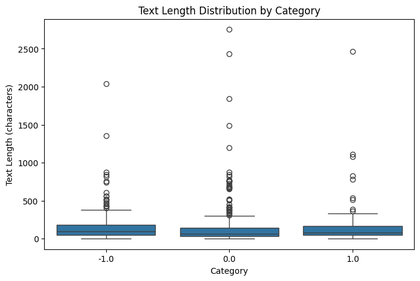
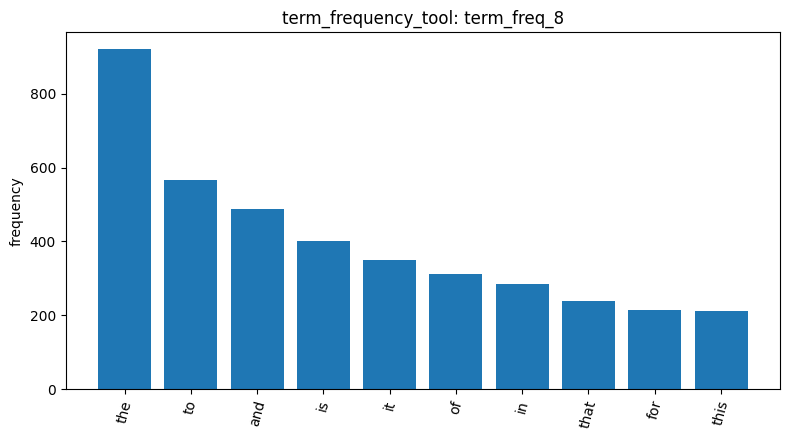
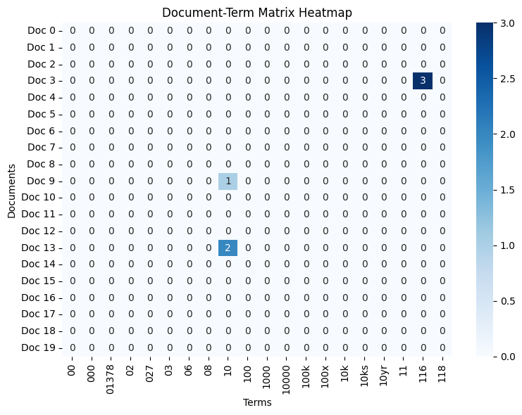
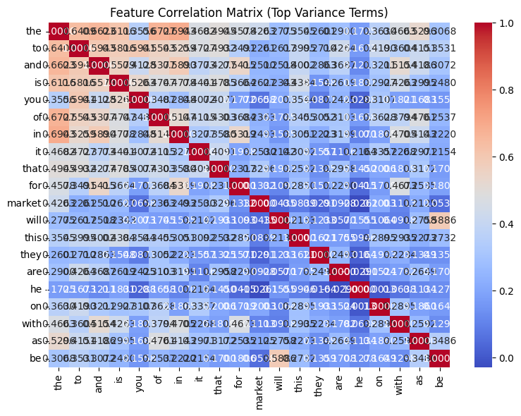
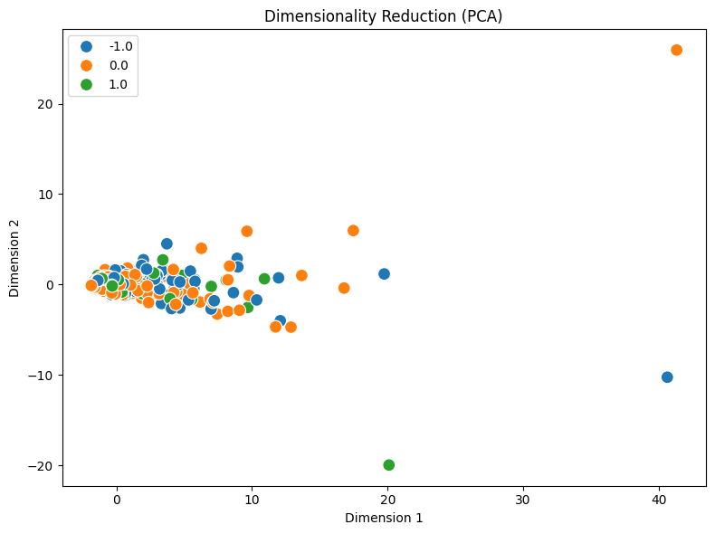
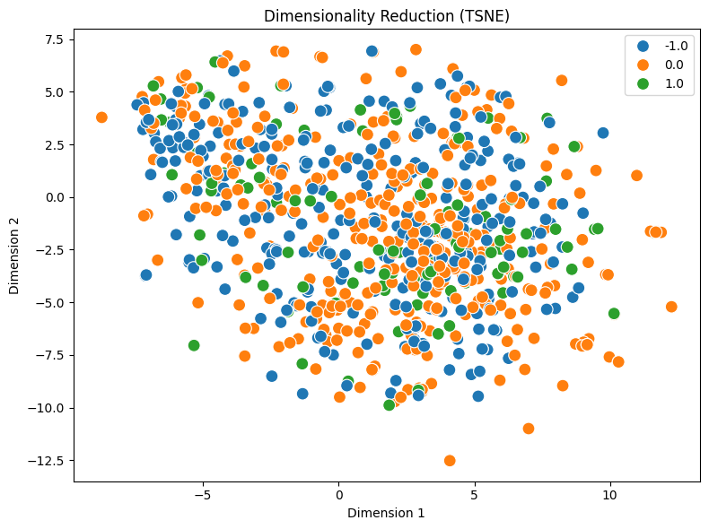
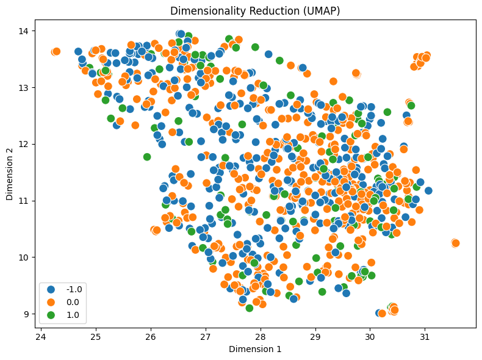

# DM2026 Lab 1 Homework Report
## Reddit Stock Sentiment Analysis

### 1. Data Loading and Exploration

I started by using load_dataset_tool to load the Reddit Stock Sentiment Dataset, which contains 847 Reddit posts (load_dataset_1). There are 423 Neutral, 315 Negative, and 109 Positive posts, so the three sentiment groups are not evenly distributed. I used check_missing_tool and found no missing values (check_missing_2). I also found 23 extra duplicate posts (check_duplicates_3), but I decided to keep all 847 posts for this exercise. From describe_data_4, the average text length is 148.68 characters, while the median is only 79 characters. This tells me that most posts are relatively short, but a few are much longer.

### 2. Text Processing and Feature Analysis

Next, I used tokenize_tool to split the posts into words and obtained 26,386 tokens (tokenize_5). I then created a Document-Term Matrix (DTM). My first attempt used max_df=1, which removed too many common words (dtm_6). After correcting this setting, the final DTM contained 847 documents and 4,346 terms, with a sparsity of 99.53% (dtm_7). From the term-frequency results, I noticed that common words such as the, to, and and appeared most often (term_freq_8). The variance filter also ranked many common words highly (variance_filter_10). I compared words with sentiment labels using Pearson and Spearman correlation, but the correlations were generally weak. For example, he had a Spearman correlation of 0.2043 with the Negative group (spearman_filter_15). This helped me understand that a frequently used word is not necessarily useful for identifying sentiment.

### 3. Frequent Pattern Mining

I used mine_patterns_tool to find words that often appeared together in posts from the same sentiment group. In the first Top-K results, most patterns contained only one word. For example, trump appeared in 45 Negative posts (patterns_18). I then tried MaxFPGrowth with lower support thresholds to find more combinations. The Positive group had 72 patterns, including {long, term} (patterns_21); the Negative group had 36 patterns, including {trump, china} (patterns_22); and the Neutral group had 31 patterns, including {market, stock} (patterns_24). I learned that frequent pattern mining can show which words appear in the same posts, but it does not mean those words are next to each other or that they always express the same opinion.

### 4. Dimensionality Reduction and Document Similarity

I used PCA, t-SNE, and UMAP to display the text data in two dimensions (reduce_dimensions_25, reduce_dimensions_26, and reduce_dimensions_27). The first two PCA components explained about 31.99% of the total variance. In all three plots, the Positive, Negative, and Neutral points were mixed together instead of forming separate groups. This suggests that the sentiment groups are not easy to separate in these two-dimensional views, although it does not tell us how accurate a classification model would be. I also converted the sentiment labels into an 847 × 3 one-hot matrix (binarize_labels_28). Finally, I compared two pairs of posts using cosine similarity. Documents 0 and 1 had a similarity of 0.0 (cosine_similarity_29), while Documents 8 and 13 had a similarity of about 0.0679 (cosine_similarity_30). Both results show low similarity between the selected documents based on their word counts.

### 5. Conclusion and Limitations

Through this homework, I learned how to use an AI Agent and different Data Mining tools to explore text data step by step. The results showed that common words can affect term frequency and feature selection, frequent patterns can reveal words appearing together, and dimensionality reduction can help visualize large text datasets. However, the sentiment groups were still mixed in the plots, and individual words had only weak correlations with sentiment. In the future, I would like to try removing common stopwords or using TF-IDF to see whether the results become clearer. I also learned that tool settings matter: I had to correct the DTM parameters, and I chose not to run sample_data_tool because it would replace the full dataset with a smaller sample and could make the data inconsistent with the existing DTM.